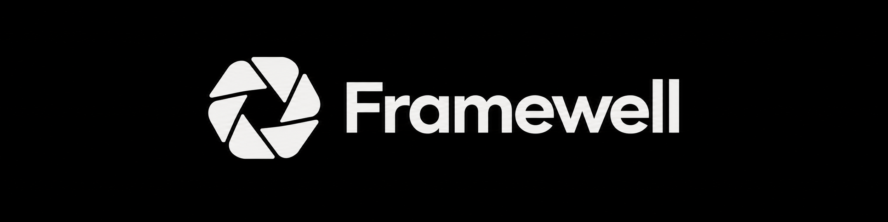

A personal photo editor and GIF studio for RezzyOwO and invited friends.

## Make every frame yours

- **Photos** — light and color adjustments, crop, comparison, text and image watermarks, and batch export.
- **GIF Studio** — video trimming, snapping, smooth selected-range playback, adjustable caption bars, Discord presets and your own saved recipes.
- **VRChat Gallery** — automatic folder detection across drives, fast cached previews and selections across monthly folders.
- **Your workspace** — saved projects, edit history, optional session recovery, and a 30-second undo when starting fresh.
- **Export** — quality previews, upload-size targets, metadata controls, batch names and folders.

## Getting started

Download [**Framewell-Installer-Win.exe**](https://github.com/RezzyOwO/Framewell_Public/releases/latest/download/Framewell-Installer-Win.exe) and run it on Windows x64. The installer includes Framewell and its media tools; no development tools are required. A short welcome flow helps you get started.

Settings, presets and recovery files default to **%APPDATA%\Framewell\Data**. Folder locations can be changed in Settings. Original photos and videos stay untouched.

Automatic update checks and installation are enabled by default. Framewell uses this repository's stable releases, verifies downloads, saves your workspace and restarts after active media jobs finish. Both settings can be switched off.

## Availability

The Windows installer is available from [Releases](https://github.com/RezzyOwO/Framewell_Public/releases/latest). This repository contains downloads, product information, release notes and distribution notices. Application source is maintained in a separate private repository.

Framewell is not open source. See [private-use terms](LICENSE).
